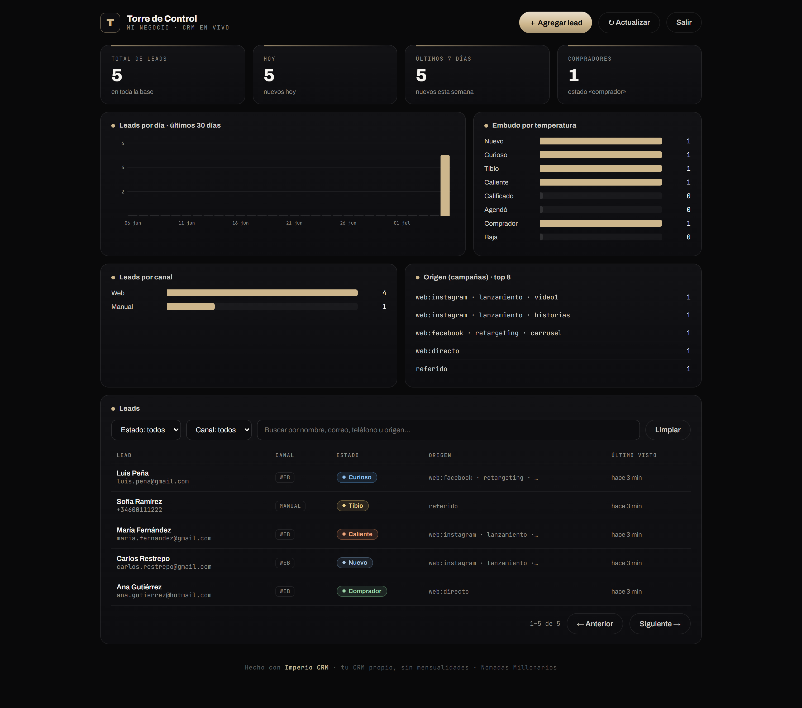
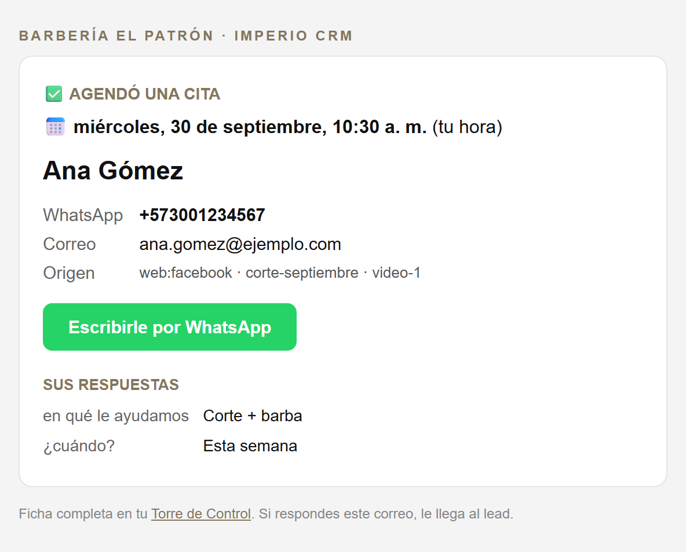
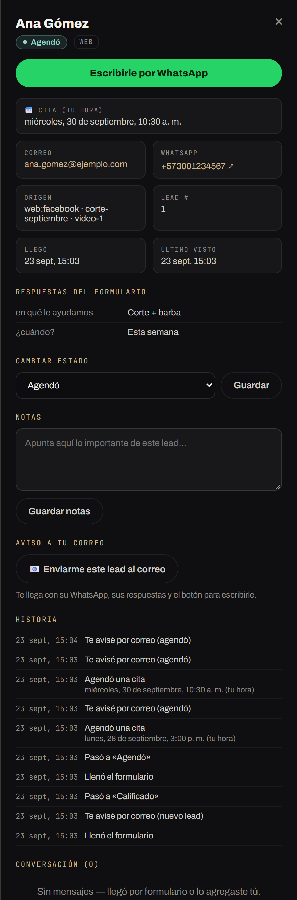

# 👑 Imperio CRM

**Tu CRM propio, gratis para siempre, en tu propia cuenta de Cloudflare.**

Deja de pagarle mensualidad a un CRM. Este es el mismo CRM que usamos en [Imperio](https://www.instagram.com/soydiegoosorio): captura los leads de tu landing, te avisa al correo con el WhatsApp de cada uno, te muestra todo en una Torre de Control visual y vive en TU cuenta. Tus datos son tuyos y nadie te puede subir el precio.



## Qué incluye

- 📥 **Captura de leads** desde cualquier landing, formulario o agenda (`POST /lead`), con atribución UTM: sabrás qué anuncio trajo a cada persona.
- 📧 **Aviso a tu correo al instante** cuando llega un lead o cuando agenda: nombre, WhatsApp, correo, de qué anuncio vino, sus respuestas y un botón verde para escribirle por WhatsApp.
- 💬 **WhatsApp a un clic**: el número queda con el indicativo de su país (+57...) aunque lo hayan escrito sin él, y la ficha tiene el botón para escribirle con el saludo ya escrito.
- 📅 **Citas en TU hora**: si un lead de Venezuela agenda a las 4 p. m. de allá, tú lo ves a las 3 p. m. de Bogotá.
- 🗼 **Torre de Control**: panel visual con leads por día, embudo por temperatura (nuevo → curioso → tibio → caliente → calificado → agendó → comprador), canales y campañas.
- ✍️ **Gestión manual**: agrega leads a mano, cambia su estado, guarda notas de cada uno.
- 🔐 **Tu clave, tus datos**: la primera vez que abres la Torre creas tu clave. Nadie más entra.
- 🎨 **Tu marca**: pon el nombre de tu negocio y tu color en 2 líneas de configuración y el panel entero cambia solo.
- 💸 **Costo: $0/mes.** El plan gratis de Cloudflare aguanta 100.000 visitas al día y Brevo manda 300 correos al día gratis. A un negocio que arranca le sobra por años. Ni tarjeta de crédito piden.

## 🆕 Novedades v1.1 · lo que aprendimos con leads reales

Cuando empezaron a entrar leads de verdad desde los anuncios, salieron estos huecos. Ya vienen resueltos:

| Lo que pasaba | Cómo quedó |
|---|---|
| El correo de cal.com no trae el WhatsApp del lead. Tenías la cita pero no sabías a qué número escribirle. | El CRM te manda **su propio aviso** con WhatsApp, correo, respuestas y botón verde para escribirle. Y en el ejemplo de agenda, el WhatsApp va escrito en las notas de la cita (lo ves en tu calendario). |
| La gente escribe su WhatsApp **sin el +57** aunque se lo pidas, y así no le puedes escribir desde un link. | El CRM completa el indicativo cuando no hay duda (`PAIS_TELEFONO`). Si no se puede saber el país, la ficha y el correo te avisan: *"confírmalo antes de escribirle"*. Los formularios de ejemplo traen selector de país. |
| La hora de la cita se guardaba en la hora del país del lead: te podías equivocar por una hora. | La cita se guarda exacta y siempre la ves en **tu** zona horaria. |
| Las respuestas del formulario no se veían en ningún lado. | Salen en la ficha del lead y en el aviso a tu correo. |
| No sabías si el aviso te había llegado. | La historia del lead dice "Te avisé por correo" o por qué no salió. Y el botón **📧 Enviarme este lead al correo** te deja probarlo cuando quieras. |
| Un formulario viejo podía devolver a "nuevo" a alguien que ya había agendado. | El formulario solo sube al lead en el embudo, nunca lo baja. |

<p>
  
  
</p>

## Instalación

> Solo necesitas una cuenta gratis de Cloudflare: [dash.cloudflare.com/sign-up](https://dash.cloudflare.com/sign-up) (2 minutos, sin tarjeta).

### Opción 1 · El botón mágico (un clic)

[](https://deploy.workers.cloudflare.com/?url=https://github.com/diegodoc11/imperio-crm)

1. Haz clic en el botón y conecta tu cuenta de Cloudflare (y GitHub).
2. Cloudflare crea tu copia del CRM **con tu propia base de datos**, todo solo.
3. Al terminar, abre `https://imperio-crm.TU-SUBDOMINIO.workers.dev/torre` y **crea tu clave de acceso**.
4. (Recomendado) Activa los [avisos a tu correo](#-activa-los-avisos-a-tu-correo-5-minutos-gratis).

Listo. Ya tienes CRM propio.

### Opción 2 · Con Claude, tu mano derecha (el método Imperio)

Abre Claude Code y pégale el mensaje que está en [`INSTALA-CON-CLAUDE.md`](INSTALA-CON-CLAUDE.md). Claude descarga el CRM, lo conecta a tu cuenta, le pone el nombre, el color y el país de TU negocio, te activa los avisos al correo, lo despliega y lo prueba contigo. Así trabajamos en Imperio: tú das la orden y la IA la ejecuta.

### Opción 3 · A mano (terminal)

```bash
git clone https://github.com/diegodoc11/imperio-crm.git
cd imperio-crm
npm install
npx wrangler login                        # conecta tu cuenta de Cloudflare
npx wrangler d1 create imperio-crm-db     # crea tu base de datos
# 👉 pega el database_id que te devuelve en wrangler.jsonc
# 👉 pon tu negocio, color, zona horaria y país en las "vars" de wrangler.jsonc
npx wrangler deploy
```

Abre la URL que te da (termina en `.workers.dev`), entra a `/torre` y crea tu clave.

## 📧 Activa los avisos a tu correo (5 minutos, gratis)

El CRM te escribe por [Brevo](https://www.brevo.com) (gratis hasta 300 correos al día).

1. **Crea tu cuenta en Brevo** con el correo donde quieres recibir los avisos.
2. **Saca tu clave de API**: en Brevo, menú de tu cuenta (arriba a la derecha) → **SMTP y API** → **Claves API** → **Generar una nueva clave**. Cópiala.
3. **Guárdala en tu CRM** junto con tu correo (son secretos: no quedan en GitHub):
   ```bash
   npx wrangler secret put BREVO_API_KEY    # pega la clave de Brevo
   npx wrangler secret put AVISO_EMAIL      # el correo donde quieres los avisos
   ```
   Si instalaste con el botón: en [dash.cloudflare.com](https://dash.cloudflare.com) → **Workers** → `imperio-crm` → **Configuración** → **Variables y secretos** → **Agregar**, tipo **Secreto**, con esos dos nombres.
4. **Pruébalo**: abre cualquier lead en la Torre y toca **📧 Enviarme este lead al correo**.

Tres cosas que aprendimos:
- **La primera vez puede caer en spam.** Márcalo como "No es spam" y desde ahí llega a tu bandeja principal.
- **No toques "Darse de baja"** en esos correos: Brevo te bloquearía y dejarías de recibir los avisos.
- Por defecto el aviso sale desde tu mismo correo. Si tienes un dominio propio verificado en Brevo (ej. `contacto@tunegocio.com`), ponlo en `AVISO_REMITENTE` y llega todavía mejor.

¿Muchos leads al día? Pon `AVISOS` en `"agendo"` y solo te llega correo cuando alguien agenda.

## Conecta tu landing

Tu CRM recibe leads con un simple `POST /lead`:

```js
fetch('https://TU-CRM.workers.dev/lead', {
  method: 'POST',
  headers: { 'content-type': 'application/json' },
  body: JSON.stringify({
    channel: 'web',
    name: 'Nombre del lead',
    email: 'correo@ejemplo.com',
    phone: '+57 300 123 4567',
    source: 'web:instagram · campaña · anuncio',     // ¿de dónde vino?
    answers: { '¿Qué te interesa?': 'Corte + barba' } // opcional: tus preguntas
  })
})
```

| Campo | Qué es |
|---|---|
| `name`, `email`, `phone` | Sus datos. Necesitas al menos el correo o el WhatsApp. |
| `source` | De dónde vino (anuncio, campaña, página). |
| `answers` | Opcional. `{ "pregunta": "respuesta" }` de tu formulario. Salen en su ficha y en tu aviso. |
| `status` | Opcional. A qué etapa pasa: `calificado`, `agendo`, `comprador`... Solo sube en el embudo, nunca baja. |
| `cita` | Opcional. La fecha exacta de la cita (formato ISO, la que te da tu agenda). La ves en tu hora. |

Puedes mandar el mismo lead varias veces (primero sus datos, luego sus respuestas, luego la cita): el CRM lo reconoce por su correo y va completando la ficha. No te llegan correos repetidos.

**Ejemplos listos para usar** (cámbiales la URL y súbelos a tu landing):
- [`ejemplos/formulario.html`](ejemplos/formulario.html): nombre, correo, WhatsApp con selector de país y una pregunta. Guarda de qué anuncio vino cada lead (UTM de primer toque).
- [`ejemplos/agenda-calcom.html`](ejemplos/agenda-calcom.html): datos → calendario de [cal.com](https://cal.com) → cita. El lead queda guardado aunque no agende, el WhatsApp va en las notas de la cita y, al agendar, te llega el aviso "Agendó" con la hora en tu zona.

## Personalízalo (sin tocar código)

En `wrangler.jsonc`, sección `vars`:

| Variable | Qué hace | Ejemplo |
|---|---|---|
| `BUSINESS_NAME` | El nombre de tu negocio (Torre, avisos y saludo de WhatsApp) | `"Barbería El Patrón"` |
| `BRAND_COLOR` | El color de todo el panel (hex) | `"#5da2e8"` |
| `TIMEZONE` | Tu zona horaria ("hoy" y las citas en TU hora) | `"America/Mexico_City"` |
| `PAIS_TELEFONO` | Indicativo de tu país, para completar los WhatsApp sin él | `"52"` |
| `AVISOS` | Cuándo te aviso: `"nuevo,agendo"`, `"agendo"` o `"no"` | `"agendo"` |
| `AVISO_REMITENTE` | Remitente verificado en Brevo (vacío = tu mismo correo) | `"contacto@tunegocio.com"` |
| `BREVO_LISTA_ID` | Opcional: cada lead con correo entra a esa lista de Brevo (tu secuencia de bienvenida) | `"3"` |

Cambias, corres `npx wrangler deploy`, y la Torre se actualiza sola.

## Preguntas frecuentes

**¿Se lo puedo pasar a alguien más?** Sí, para eso está. Mándale el link de este repo: cada persona lo instala en SU propia cuenta de Cloudflare, con su propia base de datos y su propia clave. Nadie ve los leads de nadie.

**¿De verdad es gratis?** Sí. Workers gratis: 100.000 visitas/día. Base de datos D1 gratis: 5 millones de lecturas/día. Brevo gratis: 300 correos/día. Para un CRM personal, eso es prácticamente infinito.

**Ya tenía leads guardados sin el +57, ¿qué pasa con ellos?** Nada malo: la Torre y los avisos les completan el indicativo al mostrarlos cuando no hay duda. Los que no se pueden deducir salen con el aviso de "confírmalo".

**No me llegan los avisos, ¿qué reviso?** Abre el lead en la Torre y mira su **Historia**: dice "Te avisé por correo" o por qué no salió (casi siempre es la clave de Brevo mal copiada o el remitente sin verificar). Revisa también la carpeta de spam.

**¿Se me olvidó la clave, qué hago?** Corre esto y vuelve a entrar a `/torre` para crear una nueva:
```bash
npx wrangler d1 execute imperio-crm-db --remote --command "DELETE FROM config WHERE key IN ('torre_key_hash','torre_key_salt')"
```

**¿Cómo lo actualizo cuando salga versión nueva?** Pídele a Claude: *"actualiza mi Imperio CRM con la última versión del repo"* (el prompt completo está al final de [`INSTALA-CON-CLAUDE.md`](INSTALA-CON-CLAUDE.md)). O a mano: `git pull` + `npx wrangler deploy`. Tus leads no se tocan: viven en tu base de datos, no en el código.

**¿Puedo conectarle WhatsApp o Instagram?** La base ya está lista (tablas de conversaciones y eventos). Los conectores vienen como apps del arsenal de Imperio.

**¿Es mío de verdad?** Sí: licencia MIT. Úsalo, modifícalo, úsalo con tus clientes.

---

Hecho con 🤖 e IA por **Diego Osorio · Nómadas Millonarios**, parte del arsenal de **Imperio**.
[Instagram @soydiegoosorio](https://www.instagram.com/soydiegoosorio)
